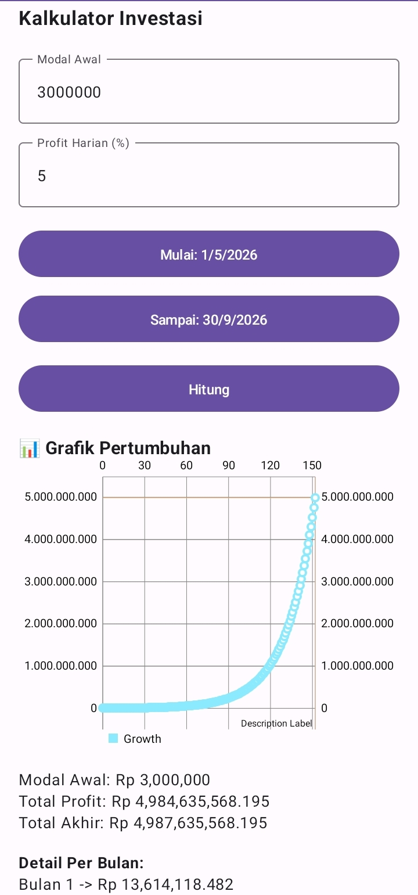

# Kalkulator Investasi (Jetpack Compose)

  

## Informasi Tugas
- **Tugas Mobile Programmer Semester 6**
- **Dosen Pengampu**: Muhammad Ikhwan Bayu Handono
- **Tugas**: Pertemuan 7

---

## Deskripsi Aplikasi
Aplikasi Kalkulator Investasi ini adalah aplikasi Android berbasis **Jetpack Compose** yang mensimulasikan pertumbuhan modal investasi berdasarkan profit persentase harian dalam rentang waktu tertentu. 

Aplikasi ini mendemonstrasikan implementasi antarmuka modern yang deklaratif dan bagaimana mengintegrasikan logika tanggal dan library eksternal di ekosistem Jetpack Compose.

## Pengaplikasian Materi Pertemuan 7
Sesuai dengan tujuan pembelajaran di PDF materi, berikut adalah penjelasan pengaplikasian kode di dalam aplikasi ini:

### 1. Struktur Layout (Jetpack Compose)
Aplikasi dibangun sepenuhnya tanpa XML, yakni dengan pendekatan `@Composable` Jetpack Compose.
- **Column**: Menggunakan layout vertikal `Column` dengan `verticalScroll` sehingga semua input dan grafik tersusun berurutan dari atas ke bawah dan bisa di-*scroll*.
- **Komponen Input**: Memakai `OutlinedTextField` agar pengguna bisa memasukkan nilai untuk *Modal Awal* dan *Profit Harian (%)*.

## Tangkapan Layar Aplikasi

  

### 2. Menggunakan DatePicker
- Untuk memilih **Tanggal Mulai** dan **Tanggal Akhir**, aplikasi memanggil fungsi bawaan `DatePickerDialog`.
- Saat tombol tanggal diklik, dialog kalender interaktif akan muncul. Hasil pilihan *User* (hari, bulan, tahun) langsung ditangkap, diformat (misalnya menjadi `1/5/2026`), lalu disimpan secara reaktif menggunakan `State` (`mutableStateOf`) pada Compose sehingga tampilan tombol otomatis diperbarui.

### 3. Visualisasi Grafik (Line Chart)
- **MPAndroidChart**: Karena belum ada komponen Line Chart kompleks bawaan yang siap pakai di Compose, aplikasi menggunakan library populer **MPAndroidChart**.
- **AndroidView**: Aplikasi mendemonstrasikan integrasi *view klasik* Android ke dalam Jetpack Compose menggunakan block `AndroidView`. Parameter `factory` membuat instansiasi `LineChart`, dan `update` memperbarui dataset titik grafik dari hasil perhitungan fungsi.

### 4. Integrasi UI dan Data (Perhitungan)
- Tombol **Hitung** akan memicu fungsi `hitungInvestasi()` yang mem-parsing input.
- Logika memecah hitungan hari (menggunakan `java.util.Calendar`), menghitung bunga per hari berdasarkan rumus eksponensial (Bunga Majemuk / *Compound Interest*), lalu merekap total per bulan untuk dicetak dalam urutan list Detail (Bulan 1, Bulan 2, dst).

---

## Cara Menjalankan Project
1. _Clone_ atau ekstrak repositori/berkas zip ini.
2. Buka **Android Studio** dan klik **Open**, lalu pilih folder proyek `InvestmentCalculator`.
3. Tunggu hingga proses **Gradle Sync** selesai (Pastikan komputer terhubung ke internet).
4. Klik tombol **Run (Play)** yang berwarna hijau di bilah atas Android Studio untuk menjalankan aplikasi di Emulator ataupun di _Smartphone_ fisik Anda.
